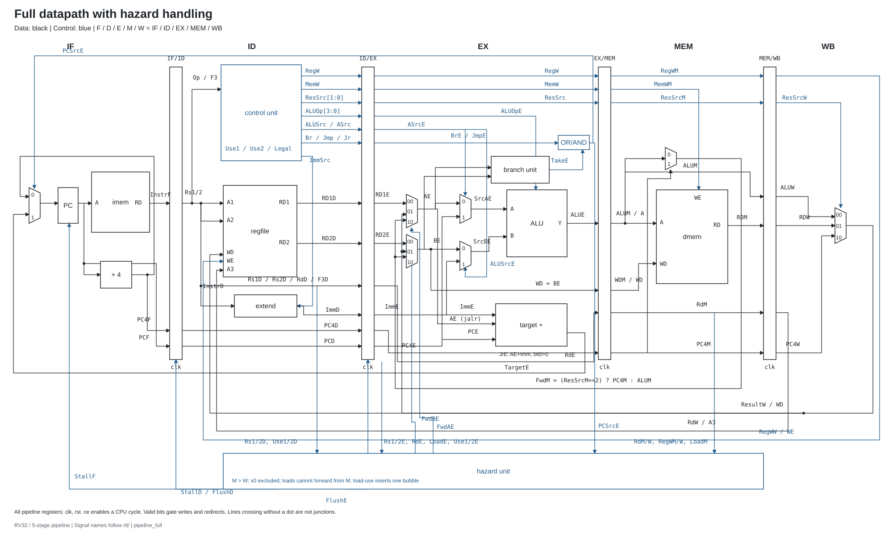
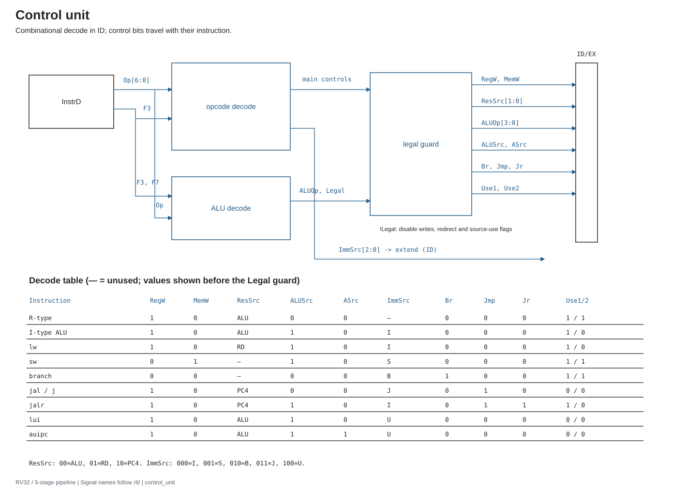
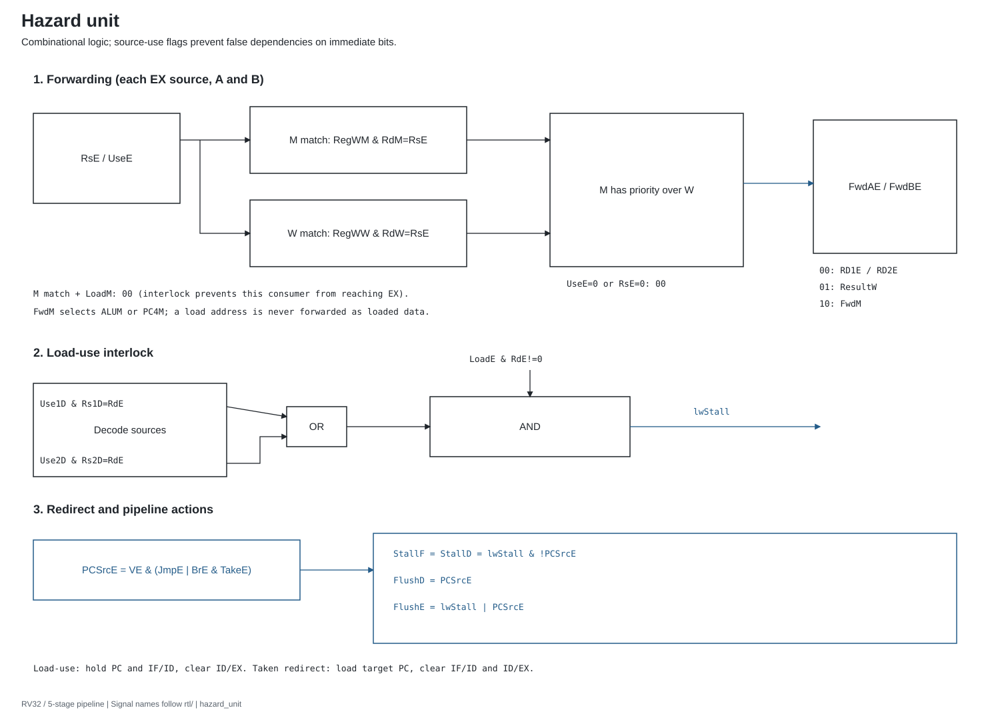
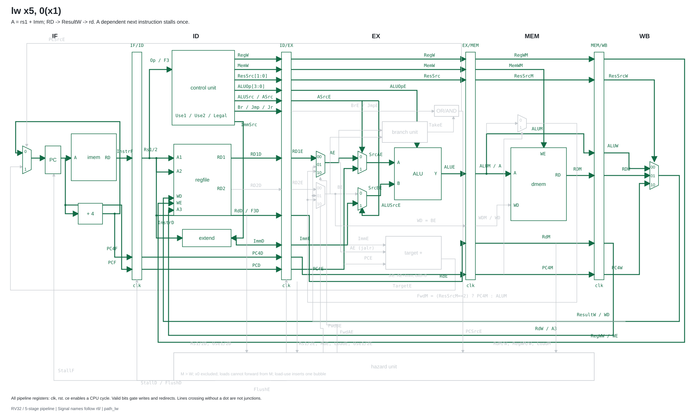
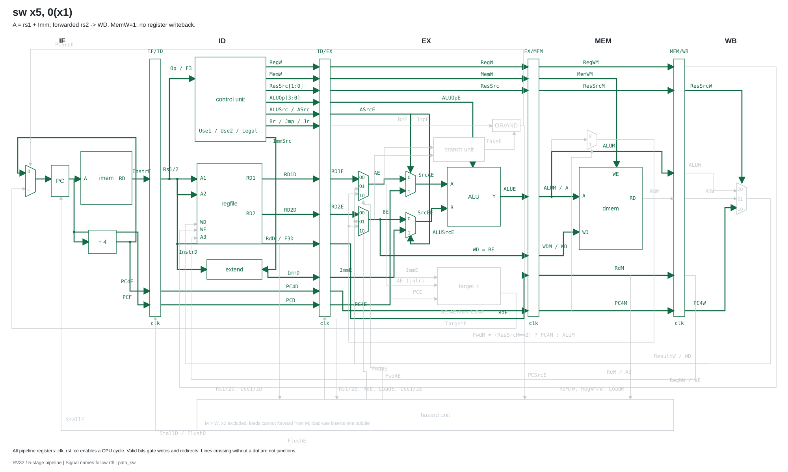
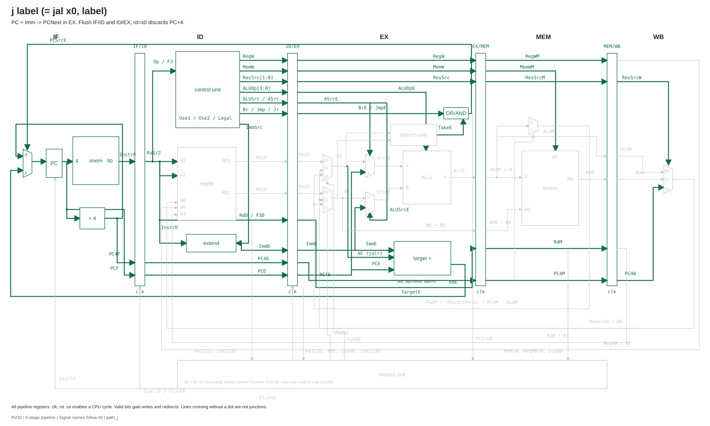
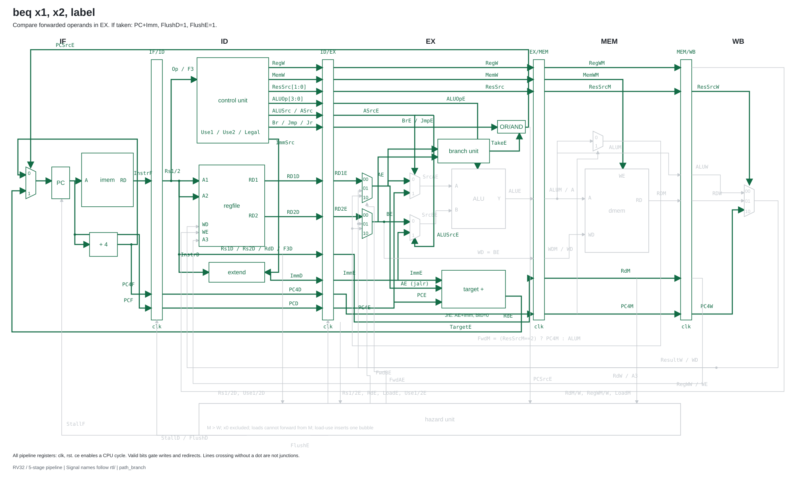
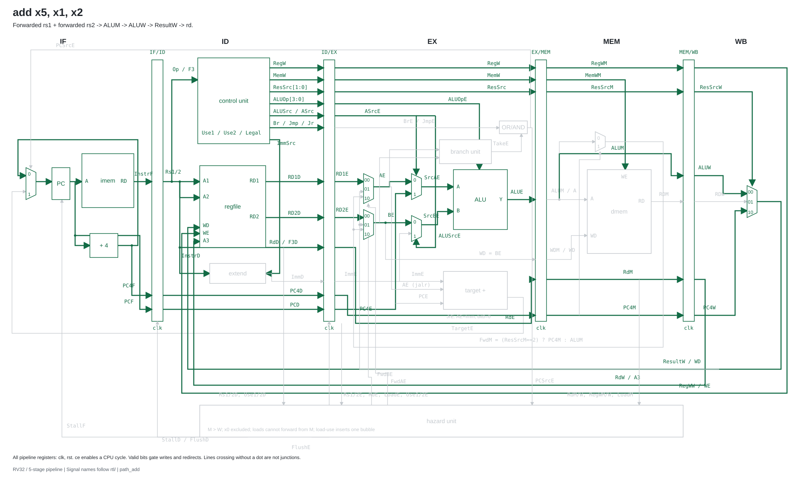
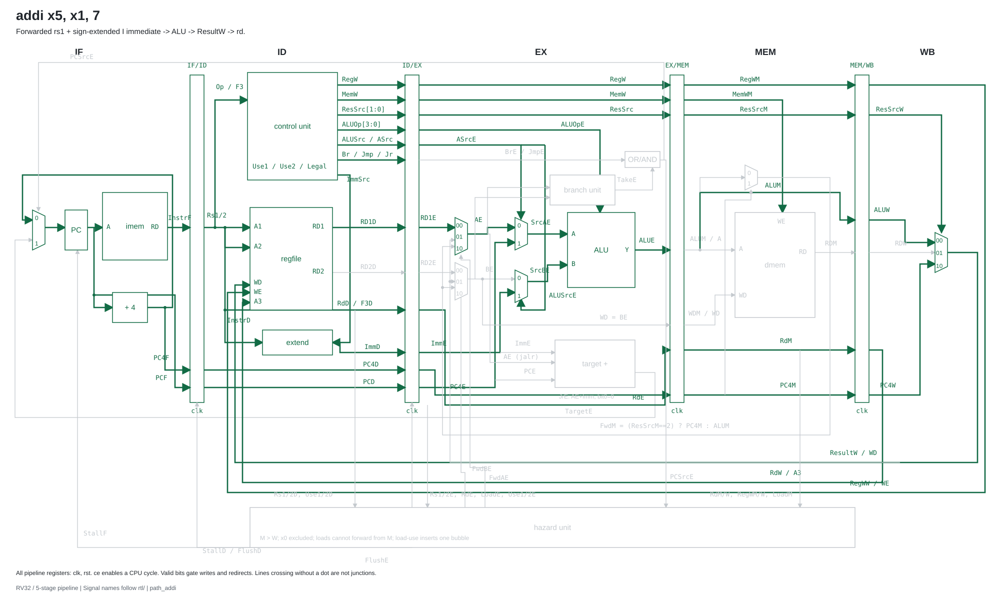

# RISC-V pipeline — Tang Nano 9K

CPU RV32 5 tầng **IF → ID → EX → MEM → WB**, viết bằng Verilog, mỗi module một file. Có forwarding **MEM→EX**, **WB→EX**, bypass **WB→ID**, stall **load-use**, và flush khi branch/jump đổi PC. Tên bộ nhớ giữ là `imem`, `dmem`; tên cổng dùng `clk`, `rst`, `A`, `RD`, `WD`, `WE`.

Đây là lõi học tập dùng một phần tập lệnh RV32I, không phải triển khai RV32I đầy đủ. Hỗ trợ `lw`, `sw`, toàn bộ 6 branch, `jal`, `jalr`, `lui`, `auipc`, các phép ALU thanh ghi/immediate. `j label` được assembler chuyển thành `jal x0, label`. Chưa có byte/halfword load/store, CSR, trap, interrupt, `ecall`, `ebreak`, `fence`, extension M/C, cache hay bus có wait-state.

## Sơ đồ tổng thể



[Mở SVG kích thước đầy đủ](docs/diagrams/pipeline_full.svg). Các sơ đồ được dựng mới bằng tọa độ vector, nét đen/xanh trên nền trắng, không dùng ảnh chụp từ sách. Mã nguồn để chỉnh sửa: [`scripts/draw_diagrams.py`](scripts/draw_diagrams.py). SVG mở được trong trình duyệt hoặc Inkscape.

## Control unit và hazard unit





## Đường đi của từng lệnh

Đường màu xanh lá thể hiện phần datapath dùng cho lệnh; phần còn lại màu xám. Các đường forwarding được chọn tùy quan hệ phụ thuộc với lệnh phía trước. [Giải thích từng bước và bảng chu kỳ](docs/architecture.md).

### `lw`



### `sw`



### `j`



### Branch



### `add`



### `addi`



## Chạy mô phỏng

Cần Python 3.10+ và Icarus Verilog (`iverilog`, `vvp`) trong PATH. Chạy từ thư mục gốc dự án:

```powershell
python scripts/test.py
```

Bộ kiểm tra so sánh từng lệnh hoàn tất và từng lần ghi bộ nhớ với mô hình ISA tuần tự, gồm chương trình directed, 24 seed ngẫu nhiên, 20.000 tổ hợp hazard, và test top-level reset/LED. Trace nằm trong `build/`. GitHub Actions chạy lại khi push.

Để xem sóng của test directed (địa chỉ dừng lấy từ label `halt`):

```powershell
python scripts/asm.py tests/directed.S build/directed.hex
python -c "import sys; sys.path.insert(0,'scripts'); from asm import assemble; from pathlib import Path; print(assemble(Path('tests/directed.S').read_text())[1]['halt'])"
# Thay HALT_PC bằng số vừa in:
vvp build/core.vvp +ROM=build/directed.hex +STOP=HALT_PC +VCD
# Mở build/core.vcd bằng GTKWave.
```

## Chạy trên Tang Nano 9K

Hướng dẫn từng bước, pin, chương trình LED và nạp SRAM/Flash: **[docs/tangnano9k.md](docs/tangnano9k.md)**.

```powershell
python scripts/asm.py programs/demo.S programs/demo.hex
& 'C:\Gowin\Gowin_V1.9.11.03_Education_x64\IDE\bin\gw_sh.exe' scripts/gowin_build.tcl
```

Đã chạy synthesis + place & route với Gowin V1.9.11.03 Education, chip `GW1NR-LV9QN88PC6/I5`, constraint 27 MHz. Kết quả bản demo: **Fmax 28,465 MHz**, **0 vi phạm setup/hold**, **1.658/8.640 logic**, **559 FF**, **4 BSRAM**. Số liệu thay đổi theo chương trình ROM và cấu hình synthesis. Chi tiết và giới hạn kiểm chứng: [docs/verification.md](docs/verification.md). Chưa xác nhận chạy trên board vật lý trong phiên tạo dự án.

## Cấu trúc

| Thư mục / file | Nội dung |
|---|---|
| `rtl/` | 20 module Verilog, mỗi file một module |
| `programs/demo.S`, `demo.hex`, `demo.lst` | ASM demo, ROM hex, bảng địa chỉ/mã máy |
| `tests/` | Testbench core, hazard, board và ASM kiểm tra |
| `scripts/` | Assembler, regression, sinh sơ đồ, build Gowin |
| `constraints/` | Pin `.cst`, clock `.sdc` |
| `docs/diagrams/` | 9 sơ đồ SVG |
| `riscv_pipeline.gprj` | Project mở bằng Gowin IDE |

Tài liệu kiến trúc lệnh được đối chiếu với [RISC-V RV32I specification](https://docs.riscv.org/reference/isa/v20260120/unpriv/rv32.html). Thông tin board theo [Sipeed Tang Nano 9K](https://wiki.sipeed.com/hardware/en/tang/Tang-Nano-9K/Nano-9K.html) và [schematic chính thức](https://dl.sipeed.com/fileList/TANG/Nano%209K/2_Schematic/Tang_Nano_9k_3672_Schematic.pdf).
