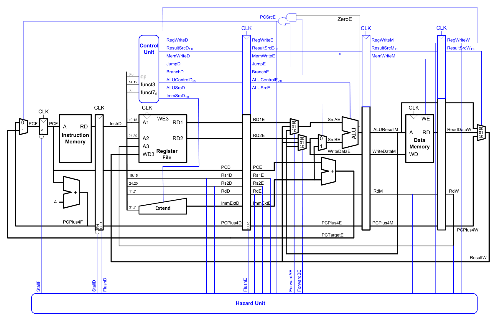

# Đối chiếu RTL với sơ đồ tham khảo

Đã đối chiếu RTL và chạy lại bộ test ngày 2026-10-01. Thiết kế khớp cấu trúc IF → ID → EX → MEM → WB và các cơ chế hazard chính trong Figure 7.61. Một số khối và đường điều khiển đã được mở rộng, nên không thể coi hình sách là sơ đồ nối dây chính xác của toàn bộ dự án.

## Hình và nguồn

[](images/harris-figure-7-61.pdf)

Sarah L. Harris và David Harris, *Digital Design and Computer Architecture: RISC-V Edition*, ấn bản 1, Morgan Kaufmann / Elsevier, 2021. Chương 7, Figure 7.61: “Pipelined processor with full hazard handling”.

- [Trang sách và tài nguyên của tác giả](https://pages.hmc.edu/harris/ddca/ddcarv.html).
- [Thông tin sách tại nhà xuất bản](https://shop.elsevier.com/books/digital-design-and-computer-architecture-risc-v-edition/harris/978-0-12-820064-3).
- [Bộ hình chính thức](https://pages.hmc.edu/harris/ddca/ddcarv/DDCArv_Figures.zip), mục `DDCArv_Figures/Ch7figs/7.61_pipelinedfull-RISCV.pdf`.

PDF trong repo là bản gốc trích từ bộ hình. PNG được render từ PDF, chỉ bỏ lề trắng bên ngoài sơ đồ; giữ nguyên các nhãn trong sách. Bản quyền hình thuộc Elsevier. Đây là hình tham khảo từ sách.

## Các khối tương ứng

| Khối trong hình | File / instance trong dự án | Đối chiếu |
|---|---|---|
| PC, bộ cộng 4, mux chọn PC | [pc_reg.v](../rtl/pc_reg.v), [adder.v](../rtl/adder.v), `pc_mux` trong [riscv_core.v](../rtl/riscv_core.v) | `PCF` chọn `PC4F` hoặc `TargetE` qua `PCSrcE`; giữ PC khi stall |
| Instruction Memory | [imem.v](../rtl/imem.v) | Đọc tổ hợp, địa chỉ byte, mỗi lệnh 32 bit |
| IF/ID | [if_id.v](../rtl/if_id.v) | Giữ khi `StallD`, xóa khi `FlushD` |
| Control Unit | [control_unit.v](../rtl/control_unit.v) | Giải mã ở ID; điều khiển đi qua các thanh ghi pipeline |
| Register File | [regfile.v](../rtl/regfile.v) | Hai cổng đọc, một cổng ghi, `x0 = 0`; bổ sung bypass WB→ID |
| Extend | [extend.v](../rtl/extend.v) | Tạo immediate I/S/B/J, bổ sung U |
| ID/EX | [id_ex.v](../rtl/id_ex.v) | Lưu toán hạng, immediate, PC, chỉ số thanh ghi và điều khiển; xóa khi `FlushE` |
| Hai mux forwarding | `fwd_a`, `fwd_b` trong [riscv_core.v](../rtl/riscv_core.v) | `00`: RD gốc, `01`: WB, `10`: MEM; MEM ưu tiên hơn WB |
| Mux ALUSrc và ALU | `alu_b`, [alu.v](../rtl/alu.v) | B chọn toán hạng đã forward hoặc immediate |
| Bộ cộng đích branch/jump | `target_add` trong [riscv_core.v](../rtl/riscv_core.v) | Cộng `PCE + ImmE`; thêm mux chọn cơ sở cho `jalr` |
| EX/MEM | [ex_mem.v](../rtl/ex_mem.v) | Lưu ALU result, dữ liệu store, PC+4, rd và điều khiển |
| Data Memory | [dmem.v](../rtl/dmem.v) | Đọc tổ hợp, ghi ở cạnh lên; dữ liệu store lấy từ `BE` sau forwarding |
| MEM/WB và mux Result | [mem_wb.v](../rtl/mem_wb.v), `wb_mux` | `ResSrcW`: 0 = ALU, 1 = dữ liệu load, 2 = PC+4 |
| Hazard Unit | [hazard_unit.v](../rtl/hazard_unit.v) | Sinh `FwdAE/BE`, `StallF/D`, `FlushD/E` |

`imem` và `dmem` được nối với `riscv_core` trong [tb_core.v](../tests/tb_core.v), không được instantiate bên trong core. Xét toàn bộ testbench và core thì có đủ hai khối bộ nhớ như trong hình.

## Tên tín hiệu

Hậu tố `D/E/M/W` tương ứng ID/EX/MEM/WB.

| Trong sách | Trong RTL | Ghi chú |
|---|---|---|
| `RegWrite` | `RegW` | Ví dụ `RegWriteD` → `RegWD` |
| `ResultSrc` | `ResSrc` | Giữ 2 bit |
| `MemWrite` | `MemW` | `MemWDc`, `MemWEc`, `MemWM` là điều khiển theo tầng; `MemWD` ở cổng core là dữ liệu store |
| `Branch`, `Jump` | `Br`, `Jmp` | Bổ sung `Jr` cho `jalr` |
| `ALUControl[2:0]` | `ALUOp[3:0]` | Mở rộng số phép toán |
| `ImmSrc[1:0]` | `ImmSrc[2:0]` | Thêm immediate U |
| `ForwardAE/BE` | `FwdAE/BE` | Giữ ý nghĩa mã chọn 00/01/10 |
| `PCPlus4` | `PC4` | Ví dụ `PCPlus4E` → `PC4E` |
| `ImmExtD/E` | `ImmD/E` | Immediate đã extend |
| `ALUResultM` | `ALUM` | Kết quả ALU tại MEM |
| `WriteDataE/M` | `BE` / `WDM` | Dữ liệu sau forwarding trước mux immediate |
| `ReadDataW` | `RDW` | Dữ liệu load tại WB |
| `PCTargetE` | `TargetE` | Địa chỉ branch/jump sau xử lý `jalr` |

## Hazard hoạt động thế nào

**Forwarding:** nếu nguồn tại EX trùng rd hợp lệ ở MEM thì chọn MEM; nếu không mới xét WB. Không forward `x0`. Với lệnh load tại MEM, hazard unit không forward địa chỉ ALU và không lấy nhầm bản cũ của cùng rd ở WB. Phụ thuộc load được giải quyết bằng stall rồi forward từ WB.

**Load-use:** khi lệnh ở EX là load, rd khác 0 và lệnh ID thực sự dùng rd đó, `StallF = StallD = 1`, `FlushE = 1`. PC và IF/ID giữ lại một chu kỳ; ID/EX nhận bubble, còn load tiếp tục đi qua MEM. Các tín hiệu `Use1/Use2` tránh stall giả khi các bit immediate trùng chỉ số thanh ghi.

**Control hazard:** `PCSrcE = VE && (JmpE || (BrE && TakeE))`. Branch/jump được quyết định ở EX. Khi đổi hướng, mux PC chọn `TargetE`, đồng thời `FlushD = FlushE = 1` để hủy hai lệnh trẻ hơn. Branch không taken tiếp tục theo PC+4. Trong hazard unit, redirect được ưu tiên hơn giữ PC do stall.

## Những điểm khác hình

1. **So sánh branch:** hình dùng `ZeroE` từ ALU với `BranchE`. RTL dùng [branch_unit.v](../rtl/branch_unit.v) nhận `AE/BE` sau forwarding, hỗ trợ `beq/bne/blt/bge/bltu/bgeu`; kết quả là `TakeE`. Quyết định vẫn nằm tại EX.
2. **JALR:** thêm `JrE`, mux chọn `AE` thay `PCE` làm cơ sở tính đích, và xóa bit 0 của tổng. Hình chỉ thể hiện đường `PCE + ImmExtE`.
3. **LUI/AUIPC:** thêm immediate U và mux `alu_a` chọn `PCE` qua `ASrcE` cho `auipc`; ALU có phép chuyển immediate cho `lui`.
4. **Forward ở MEM:** hình đưa `ALUResultM` vào mux forwarding. RTL đưa `FwdM`, chọn `PC4M` khi kết quả là link của `jal/jalr`, còn lại chọn `ALUM`; load bị chặn bởi `LoadM`.
5. **Register file:** hình có ký hiệu ghi ở cạnh xuống. RTL ghi ở cạnh lên và dùng bypass tổ hợp WB→ID để ID nhận ngay giá trị đang ghi WB trong cùng chu kỳ.
6. **Điều khiển bổ sung:** `Use1/Use2` cho phụ thuộc thật, `Legal` để loại mã lệnh chưa hỗ trợ, các bit `VD/VE/VM/VW` đánh dấu lệnh hợp lệ. Control được gói thành bus `C` trong các thanh ghi pipeline.
7. **Mô phỏng:** thêm reset, `ce` giữ toàn pipeline, và các cổng `Ret*` để testbench ghi trace. Các cổng này không xuất hiện trong hình.

## Đường đi của các lệnh đang quan tâm

Mọi lệnh được fetch qua PC → imem → IF/ID rồi giải mã ở ID.

| Lệnh | EX | MEM | WB / đổi PC |
|---|---|---|---|
| `add` | Hai nguồn sau forwarding → ALU cộng | Chuyển ALU result | ALU result → rd |
| `addi` | Nguồn rs1 sau forwarding + immediate I | Chuyển ALU result | ALU result → rd |
| `lw` | rs1 sau forwarding + immediate I → địa chỉ | Đọc dmem | Dữ liệu load → rd; lệnh phụ thuộc ngay sau cần một stall |
| `sw` | rs1 + immediate S → địa chỉ; rs2 sau forwarding → dữ liệu store | Ghi dmem | Không ghi rd |
| `j label` | Assembler mã hóa `jal x0,label`; tính `PCE + ImmE` | Không ghi dmem | Redirect ở EX, flush ID/EX; rd=x0 nên không ghi thanh ghi |
| Branch | So sánh hai nguồn đã forward, tính `PCE + ImmE` | Không ghi dmem | Nếu taken thì redirect và flush; không ghi rd |

## Kết quả kiểm tra

Chạy `python scripts/test.py` trên RTL hiện tại:

- Directed: 79 lệnh retire, 115 chu kỳ, 6 stall load-use, 13 redirect.
- Directed có ngắt `ce`: cùng 79 lệnh, 6 stall, 13 redirect; 161 chu kỳ, trong đó 46 chu kỳ pause.
- 24 seed ngẫu nhiên: trace retirement và store đều khớp mô hình tuần tự.
- Hazard unit: 20.000 vector đều đạt, gồm ưu tiên MEM/WB, x0, source-use, load và redirect.

Đối chiếu cấu trúc và các test trên chưa phải chứng minh tương đương hình thức hay chứng nhận RV32I đầy đủ. Dự án hỗ trợ tập con lệnh ghi trong README; hai bộ nhớ có độ trễ đọc tổ hợp, chưa có giao thức wait-state.

Xem dạng sóng chương trình directed:

```powershell
python scripts/test.py tests/directed.S --wave
```

Mở `build/core.vcd` bằng GTKWave; quan sát `dut.PCF`, `dut.PCD/PCE/PCM/PCW`, `StallF/D`, `FlushD/E`, `FwdAE/BE`, `dut.PCSrcE` và `Ret*`.
